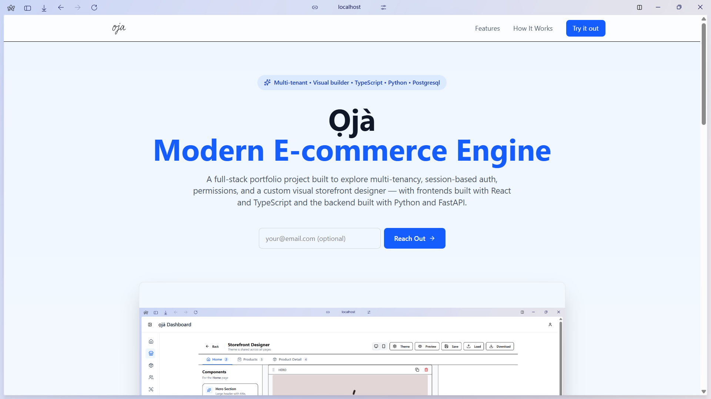
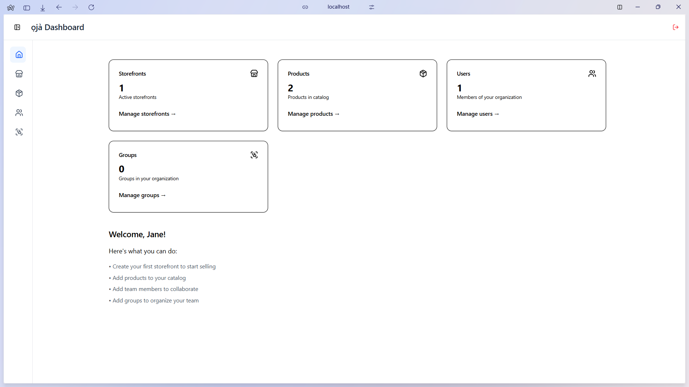
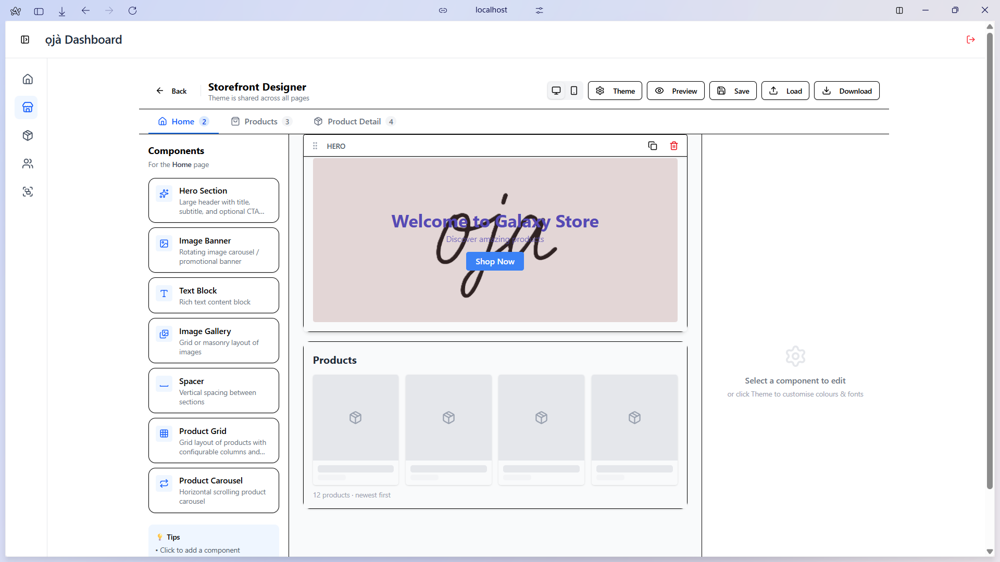
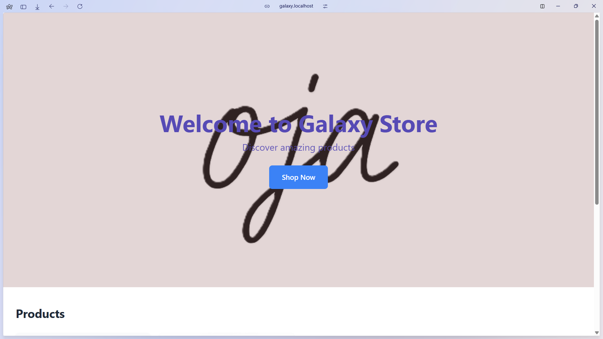

# Ọjà – Multi-Tenant E-Commerce Platform

Ọjà (Yorùbá for "market" or "marketplace") is a full-stack personal portfolio project demonstrating multi-tenant e-commerce architecture. It supports multiple independent tenants with complete data isolation, a custom visual storefront designer, secure HTTP-only cookie sessions, group-based permissions, and tenant-scoped product management.

The project consists of two main frontend applications (built with Vite + React + TypeScript) and a FastAPI backend.

## ✨ Key Features

- **Multi-Tenancy**  
  Tenant isolation with separate data scopes for users, products, and storefront configurations.

- **Visual Storefront Designer**  
  Custom builder inside the admin dashboard with live preview — lets tenants create and edit their public store layout.

- **Secure Authentication**  
  HTTP-only cookie sessions with automatic expiration and revocation on logout.

- **Permissions System**  
  Group/role-based access control; manage users and assign/remove them from groups.

- **Product Management**  
  Variants, SKUs, inventory tracking, bulk operations — everything scoped to individual tenants.

- **Frontend**  
  Two separate Vite + React + TypeScript apps:
  - **Admin** — Protected dashboard for management, user/group handling, and the visual designer
  - **Storefront** — Public-facing renderer that dynamically displays each tenant's customized store

- **Backend**  
  FastAPI with hand-written SQL queries (no ORM abstraction) for full control and performance insight.

**Not implemented (yet):** Payments, password recovery, full settings UI.

## 🏗️ Tech Stack

- **Frontend**: TypeScript, React, Vite, Tailwind CSS, Lucide Icons
- **Backend**: Python, FastAPI, PostgreSQL
- **Database**: Hand-written SQL queries
- **Auth**: HTTP-only cookies + session revocation + tenant resolution middleware

## 📂 Source Code

All code and project structure:  
https://github.com/akinolaemmanuel49/oja

## 📸 Screenshots

### Landing Page

### Admin Dashboard

### Admin Visual Designer

### Live Storefront

## 🔮 Future Ideas

- Basic payment integration (e.g., test mode)
- Password reset & email verification
- Tenant analytics
- Custom domain mapping

## 📄 License

MIT License — feel free to use as inspiration or reference for your own learning/projects!

Built with ❤️ by Abiodun  
Lagos, NG  
February 2026

Star ⭐ if you find this interesting!
