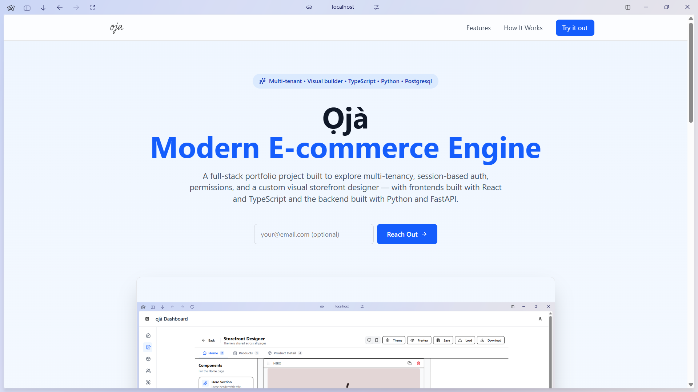
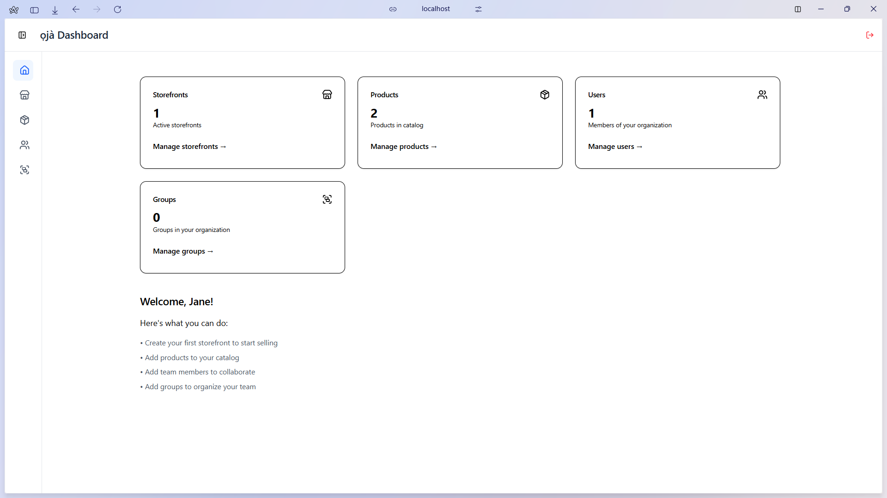
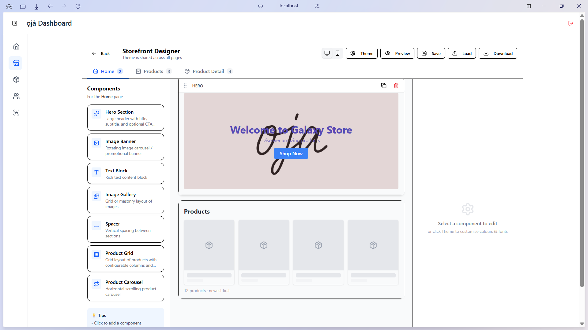
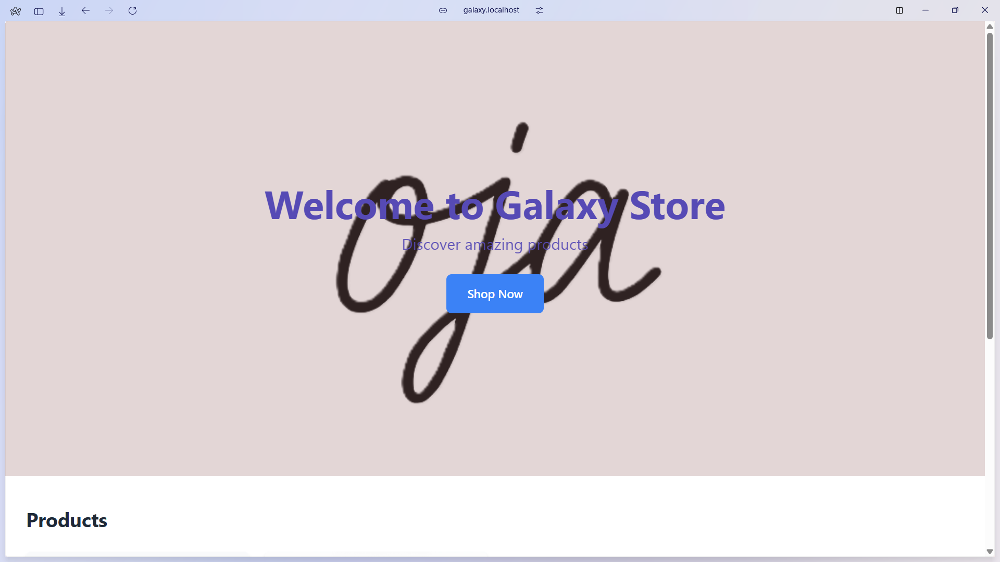

# Ọjà – Multi-Tenant E-Commerce Platform

Ọjà (Yorùbá for "market" or "marketplace") is a full-stack personal portfolio project demonstrating multi-tenant e-commerce architecture. It supports multiple independent tenants with complete data isolation, a custom visual storefront designer, secure HTTP-only cookie sessions, group-based permissions, and tenant-scoped product management.

The project is a single monorepo containing two frontend applications (built with Vite + React + TypeScript), a FastAPI backend, and shared packages.

## ✨ Key Features

- **Payments**  
  Paystack integration (test mode) — checkout, payment verification after callback, and automatic return to the originating storefront.

- **Storefront Commerce**  
  Customer sign-in, guest cart with persistence, checkout, and customer-facing order history.

- **Order Management**  
  Per-storefront orders section in the dashboard: list with status filter, detail with line items, status updates with optional notes — customers are notified by email on status changes.

- **Storefront SEO**  
  Per-storefront meta title, description, social preview image, and favicon editable from the dashboard and applied on the public store.

- **Multi-Tenancy**  
  Tenant isolation with separate data scopes for users, products, and storefront configurations.

- **Visual Storefront Designer**  
  Custom builder inside the admin dashboard with live preview — lets tenants create and edit their public store layout.

- **Secure Authentication**  
  HTTP-only cookie sessions with automatic expiration and revocation on logout.

- **Permissions System**  
  Group/role-based access control; manage users and assign/remove them from groups.

- **Product Management**  
  Variants, SKUs, inventory tracking, bulk operations — everything scoped to individual tenants.

- **Frontend**  
  Two separate Vite + React + TypeScript apps:
  - **Admin** — Protected dashboard for management, user/group handling, storefront SEO, order management, and the visual designer
  - **Storefront** — Public-facing renderer that dynamically displays each tenant's customized store

- **Backend**  
  FastAPI with hand-written SQL queries (no ORM abstraction) for full control and performance insight.

**Not implemented (yet):** email verification, full tenant settings UI, custom domain mapping, tenant analytics dashboard.

## 🏗️ Tech Stack

- **Frontend**: TypeScript, React, Vite, Tailwind CSS, Lucide Icons
- **Backend**: Python, FastAPI, PostgreSQL
- **Database**: Hand-written SQL queries + Alembic migrations
- **Auth**: HTTP-only cookies + session revocation + tenant resolution middleware

## 📂 Source Code

All code and project structure:  
https://github.com/akinolaemmanuel49/oja

### Monorepo Layout

```
oja/
  oja-app/              # Admin dashboard (React + Vite + TypeScript)
  oja-storefront/       # Public storefront renderer (React + Vite + TypeScript)
  oja-backend/          # API server (Python + FastAPI + PostgreSQL)
  packages/
    ui/                 # Shared component library (@oja/ui)
    data/               # Shared data utilities (@oja/data)
    motion-design/      # Shared animation utilities (@oja/motion-design)
  docs/                 # Design guide, database relationship map
  docker-compose.yml    # Single definition for db, api, app, storefront
```

## 📚 Documentation

- [Design Guide](docs/DESIGN_GUIDE.md) — design tokens, motion system, animation primitives
- [Database Relationships](docs/DATABASE_RELATIONSHIPS.md) — schema map, FK constraints, permission inheritance
- [Roadmap](ROADMAP.md) — merged commit history and current status

## 📸 Screenshots

### Landing Page



### Admin Dashboard



### Admin Visual Designer



### Live Storefront



## 🔮 Future Ideas

- Email verification
- Full tenant settings UI (store details, branding, gateway configuration, notifications)
- Custom domain mapping
- Tenant analytics

## 📄 License

MIT License — feel free to use as inspiration or reference for your own learning/projects!

Built with ❤️ by Abiodun  
Lagos, NG  
February 2026

Star ⭐ if you find this interesting!
